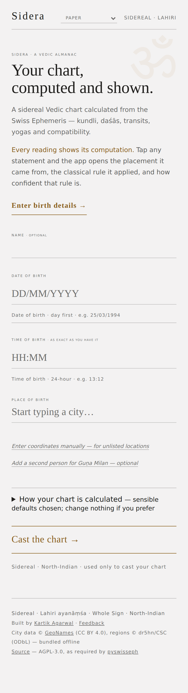
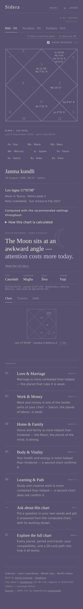
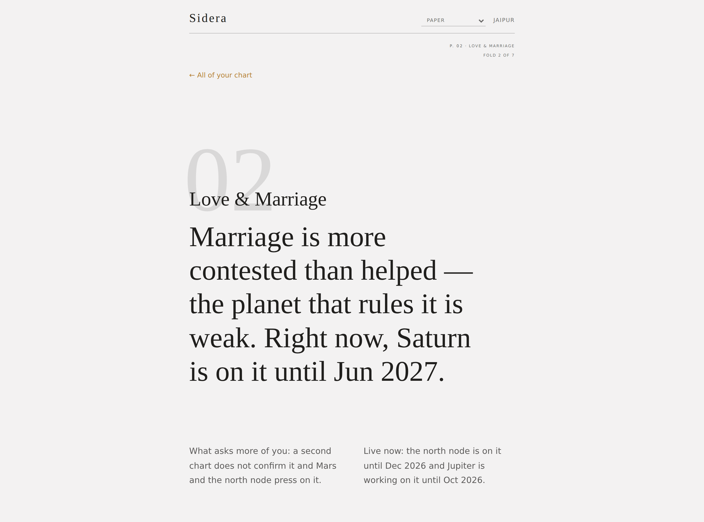

# Sidera

A sidereal Vedic astrology app: enter a birth date, time and place, and get a
North-Indian kundli with daśās, transits, yogas, doshas and compatibility.
**Every reading shows its computation** — the placement it came from, the
classical rule applied, and how confident that rule is.



The dashboard is organised by **what people ask about**, not by technique:
the wheel, a three-line identity strip and the day's verdict, then a numbered
contents page — Love & Marriage, Work & Money, Home & Family, Body & Vitality,
Learning & Path — each entry carrying a one-line condition drawn from its own
checklist. Tapping one opens the reading **answer-first** — one or two sentences a
stranger understands, carrying the actual verdict — with the six-step working
(natal houses and their lords · karaka · varga · daśā · transits by drishti ·
synthesis) underneath as expanders. Every technical section lives
behind **Explore the full chart**. See
[`ui-design/RESTRUCTURE.md`](ui-design/RESTRUCTURE.md) for the decision and
its constraints.

| Arrival | A domain reading |
|---|---|
|  |  |

## The accuracy thesis

Most astrology software asks to be trusted. Sidera is built so it can be
checked instead:

- **Nothing is approximated by hand.** Every position comes from
  [pyswisseph](https://github.com/astrorigin/pyswisseph) — sidereal, Lahiri
  ayanāṃśa, Whole Sign houses from the Lagna.
- **A second ephemeris checks the first.** The reference chart's positions
  are independently recomputed with [ERFA](https://github.com/liberfa/pyerfa)
  (the IAU SOFA-derived library, sharing no code with swisseph) and asserted
  to agree within one arcminute — `tools/erfa_cross_check.py`. Checking our
  ephemeris against itself would prove nothing.
- **Every interpretation carries its working.** Statements expand into the
  computed fact, the mechanism with the house-counting shown, and the
  classical rule verbatim, tagged **High / Moderate / Interpretive**.
- **Disagreement is displayed, not resolved.** Where classical lenses point
  different ways, "Ask your chart" shows the convergence score and lists the
  dissenting lenses side by side rather than averaging them away.
- **No language model writes readings.** The daily reading is composed from an
  authored fragment library by a seeded, deterministic pipeline: the same
  person on the same day gets the same sentence forever.
- **The one LLM feature is fenced in code, not by prompt.** "Ask about this
  chart" reads free-text questions against two things it may not depart from:
  a **fact ledger** (the computed chart, ~500 statements with stable IDs) and a
  **rule library** (`rulelib.py` — classical daśā-phala and gocara rules, each
  with its named source). It never computes. It is *required* to interpret —
  a fact-list is not a reading — and every interpretive statement must cite a
  rule ID that exists.

  For a life-domain question it must also work a **method**, not find a fact.
  `domains.py` names the houses each domain owns and why each is in the list,
  its natural significators, and the divisional chart that tests it; the
  prompt then requires **NATAL → KARAKA → VARGA → DASHA → TRANSIT →
  SYNTHESIS** in order, with the exact fact ids each step is answerable from.
  Step 5 uses drishti, not just occupancy — *"transiting Saturn in your 4th
  also aspects your 10th, so the career house is under its discipline until
  Jun 2027"* — and a claimed transit aspect that the ledger does not support
  **for the selected school** is a violation like any other.

  The ledger and the payload are not the same list. Fifteen divisions put 330
  varga facts in the ledger, and sending all of them would have quadrupled the
  prompt to make the model read fourteen charts it was not asked about, so the
  payload carries the lagna of every division plus the bodies and houses of
  D9, D10 and whichever division the question's own domain is tested by. The
  arudhas are sliced the same way and for the same reason: A1–A11 are a
  systematic table of undifferentiated rows that almost no question touches,
  so only the Upapada travels — it is read for marriage and carries an actual
  reading. That comes to roughly 215 facts of ~500. The validator still checks
  against the **full** ledger, not the payload: a smaller prompt must not
  become a smaller truth, and a fact left out of the prompt costs the model
  reach, never the reader accuracy.

  The line it works to is narrow and specific: **it may say what a period
  favours, asks for or classically tends toward; it may not say what will
  happen.** Answers are parsed and checked before display — an invented
  placement, a transit put in the wrong sign, an outcome asserted as settled
  ("you will get a job"), or a date the chart never produced are each a
  *violation*, and a violated answer is withheld rather than captioned. The
  feature is optional: with no `ANTHROPIC_API_KEY` the panel says so and
  everything else is unaffected.
- **Where sources genuinely differ, the app asks** instead of picking a side
  quietly. `schools.py` puts eight real forks to the reader as plain
  English questions — *"How far does the influence of Rahu and Ketu reach?"* —
  with two or three plain-English answers, the school name in small text
  underneath, a one-line note on what changes, an "explain this" expander, and
  the mainstream answer pre-selected and labelled **recommended**. Nobody needs
  the vocabulary to choose. Two rules are enforced by tests rather than
  intended: **no live option may be a control that changes nothing** (a chart
  is computed under each answer to prove it moves), and **the chosen school is
  printed on every verdict that depended on it** — and on none that did not.
  The machinery for showing a question whose feature is not built yet —
  explained, and disabled rather than offered — is still there and still
  tested, but nothing is using it: all eight questions are live, the last of
  them (the Upapada's two rulers) having gone live with the arudha work. That
  same answer now decides the dispositor in viṃśopaka too, which is why it is
  one question and not two. See also the yoni and vaśya notes in
  `gunamilan.py`.

- **The full ṣoḍaśavarga — fifteen divisions, cast at degree level, each gated
  against the oracle.** D2 Horā, D3 Drekkāṇa, D4 Caturthāṃśa, D7 Saptāṃśa,
  D9 Navāṃśa, D10 Daśāṃśa, D12 Dvādaśāṃśa, D16 Ṣoḍaśāṃśa, D20 Vimśāṃśa,
  D24 Siddhāṃśa, D27 Bhāṃśa, D30 Triṃśāṃśa, D40 Khavedāṃśa, D45 Akṣavedāṃśa
  and D60 Ṣaṣṭyāṃśa — the sixteen of the classical set, less the birth chart
  itself. A `VargaPosition` carries a longitude, not just a sign, so a varga
  nakṣatra and dignity by degree are computable: the part index is
  `floor(deg / (30/N))` and the degree inside the divisional sign is the
  remainder *stretched* back over 30° — a scaling convention, labelled as one
  in the rule library (`rule.varga.degree_convention`), not a classical
  statement dressed up as one. **Every division is checked body by body
  against PyJHora on both fixtures before it appears in the gallery** — 300
  comparisons of sign and longitude alike, plus a 400-chart differential run
  per division, and the rules were derived from the oracle and verified
  exhaustively before the module was written rather than recalled and hoped
  for.

  Five divisions are **flagged on the plate** with the rule they were cast
  under, and the five are two different kinds of thing. **Three are the
  reader's to choose** — the D2 horā (twelve-sign or the Sun/Moon binary),
  the D3 drekkāṇa (Parāśarī trines or parivṛtti-traya), and the D27 bhāṃśa
  (whether even signs count backward) — each a question in `schools.py` with
  both answers gated. **Two are a stated convention with no alternative
  offered**: D30's unequal 5·5·8·7·5 bands that reverse between odd and even
  signs, and D60's ½°-per-division count from the sign itself. Where schools
  diverge the app names the fork; it does not pick one quietly.

- **Strength, significators and points, read across those divisions.**
  Viṃśopaka bala scores each of the seven visible grahas out of twenty across
  a group of charts — ṣaḍvarga, saptavarga, daśavarga or ṣoḍaśavarga, itself a
  reader's choice, since the same graha scores differently under each and a
  reader comparing Sidera against another astrologer needs to know which group
  produced the number. Rahu and Ketu are not scored, and the app says why
  rather than leaving a gap: the ladder rests on owning a sign and on
  friendship with the sign's lord, and the nodes rule nothing. The **chara
  karakas** rank the grahas by degree for the eight offices (or seven, if Rahu
  is left out — another fork), giving the Ātmakāraka, the Dārakāraka and the
  Kārakāṃśa; **arudha padas** A1–A12 are computed by reflection with the
  1st/7th exception, the Upapada among them; and **avasthās** give each graha
  its bālādi age and its jāgradādi waking state. Each of the five is gated
  against the oracle where an oracle exists, and where none does — the
  avasthās — the module says so in as many words instead of implying one.

- **Aṣṭakavarga is raw, and the app says so.** BAV and SAV are computed from
  the classical benefic-point tables; the reductions — trikoṇa and
  ekādhipatya śodhana, and the Śodhya Piṇḍa built on them — are *not*
  applied, because published implementations diverge on the order the two are
  performed in, and a disputed method printed as an exact number would be
  worse than no number. Every one of the nineteen ledger facts carries
  `raw: True`.

  The gate is per SIGN, against an independent implementation, for both
  fictional charts. That distinction earned itself immediately: four rows of
  the 56-row table were wrong when first written down and **every classical
  checksum passed** — Sun 48, Moon 49, Mars 39, Mercury 54, Jupiter 56, Venus
  52, Saturn 39, total 337 — because a bindu at the wrong offset moves where
  it lands, not how many there are. The totals count table rows and are the
  same for every chart; the per-sign distribution is what varies, and it is
  what the gate compares.

### The test suite distinguishes two kinds of guarantee

A green suite can mean "still correct" or merely "still the same". Sidera
separates them: every test declares its provenance in `conftest.py` as

| Class | Meaning | If it goes red |
|---|---|---|
| `external` | Anchored to a source outside this build — a second ephemeris, a classical rule, published astronomy, a design document | **The code is wrong.** Do not edit the expectation |
| `invariant` | True by definition, mathematics, or an explicit product rule | **The code is wrong.** |
| `characterization` | Froze observed output — protects continuity, not correctness | May be re-baselined, and the commit must say so |

`test_hygiene.py` fails if any test is undeclared, if the conformance audit's
counts drift from reality, or if a dependency loses its version pin. Current
split is generated into
[`ui-design/FRAMEWORK-AUDIT.md`](ui-design/FRAMEWORK-AUDIT.md).

Roughly 42% of the suite is `characterization`, and the honest reason is
worth stating: the reference chart is **fictional**, so most chart-derived
expectations cannot be anchored to anything outside this build. They are
labelled accordingly rather than dressed up. What genuinely anchors the
numbers is the ERFA cross-check above and `TestAstronomicalAnchors` —
person-free published facts (Spica at 180°, the epoch ayanāṃśa, a catalogued
eclipse) that anyone can verify in any ephemeris.

## How it speaks

Answer first, one breath, then the working. Every domain card, domain view and
`/ask` reply opens with the verdict in words a stranger understands; the
working, the Sanskrit and the house numbers begin one tap down, where a term
can be glossed and a claim can be checked. Hard budgets — 20 words on a card,
120 on a synthesis, 80 on an agent lead — with one caveat, at the end, one
line.

This constrains the **order and economy** of speech, never its honesty. The
validator, the fact ids, the rule citations and the confidence labels are
unchanged: the agent's verdict is validated exactly as its answer is, because
the headline is the worst possible place for a claim to escape.
[`voice.py`](voice.py) holds the doctrine and `TestEditorialDoctrine` enforces
it, including a banned-phrase list tested in both directions — that it catches
the real offenders, and that it fires on none of the honest sentences.

## How it looks

Five screens, always one tap apart from a tab row in the masthead:

| Today | the dated sky, for this chart |
|---|---|
| **Readings** | the contents page, and a verdict-first fold per domain |
| **Your charts** | fifteen divisional plates as a gallery, each with its own reading, plus the strength fold |
| **Explore** | eight categories, one open at a time |
| **Ask** | a question in your own words, answered from the computed chart |
| *Numerology* | *in preparation — named where it will be, and not built* |

An almanac, set as printed matter: a numbered fold per view with its folio
top-right — two levels of it, so `P. 02·1` is the first reading and `P. 03·2`
the second plate — the wheel as a captioned **Plate I**, the Readings screen
as a table of contents, and the working folded under footnote-style
`show the working ↓` lines. Hairline rules and whitespace do all the
separating — nothing is boxed, nothing has a shadow, and the only radius in
the stylesheet is 0 or 50%.

It reads as **paper** by default, with **Night reading** as the single
alternate — two palettes, not six. One bronze accent, split by role because
`#a37129` is 3.80:1 on paper: bright enough for plate strokes and display
type, not enough for a link, so `--accent-ink` is the same hue darkened until
it clears AA. Every pair is recomputed from the stylesheet by
`TestPaperPalette` rather than trusted from a table.

Flatness is a real failure and it got four devices rather than a gradient.
A **second surface tone** carries everything that sits *behind* a reading —
Explore's tables, every expander — so a fold separates by tone and not only
by rule; it was deepened from 1.08 to 1.19 against the paper because at 1.08
it was a tone in the tokens and nothing on the screen. A **paper grain** rides
the page background alone: one `feTurbulence` desaturated to grey at 5.5%
inside its own SVG data URI, off entirely under `prefers-contrast: more`.
Section heads sit under a **1.5px rule** where the hairlines are 0.16 ink, so
hierarchy is legible before a word is read. And the **bronze is the plate's
ink** and the verdict's emphasis, which gives the eye one anchor per screen —
that change is what surfaced a pre-existing failure, the plate having been
drawn at 2.28:1 against a 3.0 non-text floor the whole time. Deepening the
tone has a hard stop: `--accent-ink` on the surface is the binding pair at
4.96:1, and the gate recomputes all of it.

Today opens on the day, named twice — once by the civil calendar and once by
the Moon — then three or four dated lines, each naming a graha and saying
when: *"Ketu leaves the degree of your Venus today — the four-month stretch on
comfort closes."* `today.py` computes both edges of a contact by bisection,
because the ledger knows the current gap and not the boundary, and without the
date the line would read *"Ketu is on your Venus"*. The birth plate pins
beside it with today's transits ticked around its **outer** edge: the plate is
the birth moment, and today is a marginal note on it.

Scrolling is choreographed: fold rules draw in left to right, the chart plate
pins beside the day's verdict and releases at the last contents entry, a ghost
folio numeral carries down-leaf, and each domain opens on a full-viewport
verdict that rises into place. CSS scroll-driven animation where the browser
has it, an IntersectionObserver everywhere else, and
`prefers-reduced-motion: reduce` turns all of it off while keeping the pin —
asserted in a browser with the preference actually set.

The type has **floors**, not just a scale: 20px for a section title, 16 for
anything anyone reads a sentence of, 15 for a table cell, 13 for a label.
Below the display range those are the only sizes that exist, and every one of
them is named by role in the stylesheet rather than typed as a number. A
browser gate walks every visible text node at both widths and fails on
anything under 13 — including SVG text, which is sized in user units the
viewBox then scales, so the same declaration is 7 rendered pixels in one
figure and 24 in another.

The plates carry real marks: the glyph a printed plate uses beside the
two-letter abbreviation, natural malefics set in heavier ink (weight, never
hue), `℞` for retrograde, `⊙` for combust, and the lagna at the head of its
own house in the accent. Which of those a cell can hold is decided from the
polygons — the anchor tables say where a stack is hung and cannot see how wide
it is, which is how three marks measuring 104 user units ended up in a cell 73
across. A browser gate reads the real bounding boxes and checks every corner
against the house it belongs to.

**Ask** is a screen, not a panel. It opens on one thing — *Put a question to
your chart* at display size over a large centred field, with three suggested
questions as quiet links under it — and it opens on it whether or not an
answer can be produced, because whether an answer can be produced is a
question about the answer and not a reason to refuse someone the chance to
ask. A reply lands verdict first: one bold line, then two short paragraphs,
then a **Facts used ▸** footnote listing the fact and rule IDs the answer
cited. The six-step walk is shown rather than described — natal, karaka,
varga, daśā, transit, synthesis, each marked as having fired or not and each
expanding to the facts it actually used. That mark is **derived from the
citations**, never self-reported: a step that fired is a step whose facts
appear in the answer. A withheld answer gets its own state and keeps the
working visible, so a refusal is legible instead of blank.

Combinations lists each yoga as **one closed row** — name, a one-line verdict,
a classification chip — and opens the full reading only on click, one at a
time. The word budgets are the same either way; what changed is that a chart's
yogas are now a page you can scan rather than a page you must read.

Explore's **Points** section carries the twelve arudha padas and the Upapada,
**Significators** the chara karakas with the Ātmakāraka, Dārakāraka and
Kārakāṃśa named, and a **Strength** fold on Your charts gives each graha its
viṃśopaka score out of twenty with the per-division arithmetic folded under
it. The Grahas table gained an **Age** and a **Waking** column for the bālādi
and jāgradādi avasthās, and the daśā line now runs three deep: mahādaśā,
antardaśā and **pratyantardaśā**.

Where two schools give two answers, **the screen shows both, side by side and
weighted the same.** The Upapada under the two co-lord readings is the case
that forced the rule: Scorpio and Aquarius have two claimed lords, the two
readings put the Upapada in different houses, and a reader meets the pair with
the school named above each and the reason for the split stated once
underneath. There is no error styling on it, neither side is dimmed, and no
verdict is composed from the two — the marriage reading prints the Dārakāraka
and the Upapada as they fall even when they disagree. `TestTwoTraditionsReadAsTwoAnswers`
holds that line in a browser: a hedging word, a warning border, one side
dimmed, the reason dropped, the second reading dropped, or a composed verdict
smuggled in each turn it red. Two traditions disagreeing is the product, not a
state the app is unsure of.

Two faces: **Tiro Devanagari Sanskrit**, drawn by John Hudson to set
Sanskrit — it carries both the transliteration range and the Devanagari
block, so *Navāṃśa* sets in one face instead of falling back mid-word — and
**IBM Plex Sans** for the working text and the true tabular figures an
ephemeris table needs. The structural signature is borrowed from the script
itself: Devanagari hangs from a headline rather than sitting on a baseline,
so every section marker here is **a rule with its heading beneath it**.

[`ui-design/DOSSIER.md`](ui-design/DOSSIER.md) carries the direction and the
reasoning; `TestEditorialDossier` measures it in a browser at 390px and
1280px.

## Stack

Python 3.11 · Flask (server-rendered Jinja) · pyswisseph · gunicorn in
production. No database. The city lookup is a bundled offline GeoNames
extract, and every computed section works with no network and no keys. Front
end is hand-written CSS and vanilla JS with no build step.

The single exception is the optional "Ask about this chart" agent, which
calls the Anthropic API server-side using `ANTHROPIC_API_KEY`. It is off
unless that variable is set; see [DEPLOY.md](DEPLOY.md).

**Ephemeris note:** no `.se1` files are shipped, so swisseph uses its built-in
Moshier analytical ephemeris — sub-arcsecond over the dates this app handles,
and the reason the container needs nothing mounted. `engine.ephemeris_backend()`
reports which source is live, and a test asserts it, so adding ephemeris files
via `SE_EPHE_PATH` is a visible change requiring gate re-verification.

## Run it locally

```bash
git clone <this repo>
cd vedic-astro
python -m venv .venv && source .venv/bin/activate
pip install -r requirements.txt
python app.py                     # http://localhost:5000
```

Run the suite:

```bash
pytest                            # gates + hygiene
pytest -m external                # only externally anchored tests
```

One gate drives a real browser: the birth date and time are **masked text
fields**, because `<input type="date">` and `<input type="time">` render in the
viewer's *system* locale — `03/04/1990` meant two different dates to two
visitors, and a 12-hour system clock rejected a typed `13`. No assertion on an
HTML string can see that, so `TestMaskedBirthFieldsInARealBrowser` types into
the rendered form instead. It needs playwright, which is **not** in
`requirements.txt` (140 MB the running app never imports):

```bash
pip install -r requirements-dev.txt && playwright install chromium
```

Without it that class skips and says so; every other gate still runs.

Serve it the way production does:

```bash
PORT=8000 gunicorn app:app --bind 0.0.0.0:$PORT
```

Deployment steps for Render are in [DEPLOY.md](DEPLOY.md).

## Verification fixtures

**No real person's birth record is committed to this repository.** The gate
suite runs on two fictional charts kept in one place in `fixtures.py`: a
reference chart and a second one so the compatibility gates pair two
different people rather than a chart with itself.

Supply your own with `SIDERA_FIXTURES=/path/to/fixtures.json`; the anchored
gates then skip, because their expected values belong to the built-in charts
and inventing values for another chart would defeat the point of an anchor.

```bash
pip install pyerfa numpy          # dev-only, not an app dependency
python tools/erfa_cross_check.py  # re-derive the cross-check constants
```

## The oracle fixture

`fixtures_pyjhora.json` holds a **second implementation's answers** for the
two fictional charts, computed by [PyJHora](https://github.com/naturalstupid/PyJHora)
— an independently written Vedic astrology library that Sidera does not link,
import or ship. It covers all 23 divisional charts **with degrees**, bhava
arudhas A1–A12, chara karakas, Ashtakavarga BAV/SAV, sphutas and Shadbala —
and it now carries **variant blocks** as well, so a school Sidera offers but
PyJHora does not compute by default can still be gated against a second
implementation rather than pinned by closed form. Fifteen of those divisions
are Sidera's own gate, body by body on both charts, together with the arudhas,
the chara karakas, viṃśopaka and the pratyantardaśā boundaries; the rest are
the map of what is still unbuilt. The avasthās are the one built module with
no oracle behind them, and `avasthas.py` says so in its first paragraph rather
than letting a green suite imply otherwise.

It is an *oracle*, not a dependency. The moment our answer and its answer come
from the same code, the agreement proves nothing — so `test_hygiene.py` fails
if any app module imports `jhora`. Regenerate with:

```bash
./tools/oracle/make_oracle.sh     # scratch venv OUTSIDE the repo; only the JSON is committed
```

**Four settings in that script are the whole reason it can be trusted**, and
every one is a trap at its default. Each would have produced a fixture
disagreeing with Sidera for a reason that has nothing to do with either being
wrong:

| | PyJHora default | Pinned to | Size of the difference |
|---|---|---|---|
| Ayanāṃśa | `TRUE_PUSHYA` | `LAHIRI` | 4106″ (1.14°) |
| Nodes | true node | mean node | up to ~1.8°; 1.48° on the partner fixture |
| Positions | `FLG_TRUEPOS` (geometric) | apparent, light-time corrected | 20.2″ Sun, 0.72″ Moon |
| Daśā year | `TRUE_SIDEREAL_YEAR` | `MEAN_SIDEREAL_YEAR` | up to a full day — see below |

The ayanāṃśa needed pinning in *two* places (internal call sites re-read
`const._DEFAULT_AYANAMSA_MODE`); the node switch needed a third (`drik`'s
planet tables are built from the constants at import time). The last two were
found by the 300-chart differential run, not by reading the source.

With all four pinned, all ten bodies agree with Sidera's D1 **to JSON rounding
(~0.002″)**, and every one of the 81 Vimshottari MD/AD boundaries agrees to
under a minute. That is the precondition: a comparison of arudhas or
Ashtakavarga means nothing until the underlying chart matches.

Being that exact also changes what the D1 comparison *proves*. With the
conventions matched, both sides are the same swisseph called the same way, so
this is a check on conventions and plumbing, not on the ephemeris — the
ephemeris is anchored by ERFA, and PyJHora's independence is spent where it
is worth more: nakshatras, vargas, daśās, arudhas, Ashtakavarga.

**Upapada has two schools, and both are exported.** An arudha is counted from
the lord of the house, and Scorpio and Aquarius have two lords each. *Parashari*
counts from the sole classical lord (Mars, Saturn); *Jaimini* counts from the
**stronger** of the two co-lords, so Ketu or Rahu can carry it. The Upapada
Lagna is the arudha of the 12th, and it is read for marriage. Sidera names the
school rather than picking a winner silently, the way `gunamilan.py` handles
the yoni and vaśya splits — and where the two readings put the Upapada in
different houses, **both are printed side by side**, weighted the same, with
the reason for the split stated underneath. On the reference chart the schools
diverge at A7 (Gemini vs Scorpio); the file records exactly where. The same
answer decides the dispositor in viṃśopaka: on the reference chart the Sun in
Scorpio rates 18 out of 20 for that division with Mars as its lord and 15 with
Ketu, and the difference propagates into every group the division belongs to.

### The differential run

Two charts cannot exercise a sign boundary, a polar ascendant, a leap day or a
DST transition. `tools/oracle/differential.py` generates **300 random charts** —
random date in 1950–2030, random time, random city — and diffs both engines
across D1 longitudes, signs, nakshatra/pada, D9/D10 signs and every Vimshottari
MD/AD boundary. The records are synthetic and are **not committed**; the seed
reproduces them, and `tools/oracle/DIFFERENTIAL.md` is the committed summary.

It has already paid for itself three times:

- **Found a Sidera bug.** Our Vimshottari used the Julian year (365.25 days).
  That was the *only* thing separating our timeline from PyJHora's — every
  boundary drifted at 0.0064 days/year and nothing else differed. Fixed to the
  sidereal year (365.256364), which is also the coherent choice for a system
  measured against fixed stars. Pinned by `TestVimshottariAgainstTheOracle`,
  which asserts the old constant would fail.
- **Diagnosed the arcsecond residual.** Every remaining difference was
  `FLG_TRUEPOS` — the Sun's 20.2″ is 8.3 light-minutes × 0.986°/day. The
  Moon's 0.72″ looks negligible and is not: it is 1.5 × 10⁻⁵ of a nakshatra,
  which moved every daśā boundary in the fixture by hours through the balance
  at birth.
- **Found a defect in the oracle.** PyJHora's default daśā year,
  `drik.true_sidereal_year()`, returns values up to a full day too long on
  some charts — impossible for a sidereal year, which varies by minutes.

With all conventions matched: **zero disagreements across all 300 charts**.

One honest caveat recorded in the file itself: the BAV per-planet totals
(48/49/39/54/56/52/39, summing to 337) are **identical for every chart** —
they count rows in the classical benefic-point tables and depend on no birth
moment. They gate the tables, not a chart. The per-sign arrays are what
actually vary and what a real comparison must use.

## Licence

**AGPL-3.0** — see [LICENSE](LICENSE).

This is not a preference; it is inherited. Every position in this app comes
from [pyswisseph](https://github.com/astrorigin/pyswisseph), which is
distributed under the GNU Affero GPL v3 (`License :: OSI Approved :: GNU
Affero General Public License v3`, and the full text ships in its wheel). The
underlying Swiss Ephemeris is dual-licensed by Astrodienst — AGPL, or a paid
Swiss Ephemeris Professional licence — and this build takes the AGPL arm. A
work that links AGPL code and is conveyed must itself be AGPL, so Sidera is.

Two consequences worth stating plainly:

- **§13, the network clause.** Anyone who interacts with a running instance
  over a network must be offered the Corresponding Source. A public repository
  alone does not do that; the *running app* has to point at it, which is why
  the page footer carries a **Source** link. That link is part of the licence,
  not a courtesy.
- **Nothing changes in practice.** The repository is already public, no
  ephemeris `.se1` files are shipped (swisseph falls back to its built-in
  Moshier model, itself AGPL under the same terms), and no proprietary code is
  vendored. The licence file records the position that already held.

`fixtures_pyjhora.json` is generated by PyJHora, also AGPL-3.0 — compatible,
and in any case it is committed data rather than linked code.

## Layout

```
app.py            Flask routes and view assembly
engine.py         ephemeris, Lagna, sidereal positions, Whole Sign houses
dashas.py         nakṣatras and the Vimśottarī tree
pancanga.py       tithi, nakṣatra, yoga, karaṇa, sunrise/sunset
vargas.py         fifteen divisional charts at degree level, D2 … D60
transits.py       gocara, drishti, ingress finder
ashtakavarga.py   raw BAV and SAV — the benefic-point tables, per sign
arudhas.py        arudha padas A1–A12 and the Upapada, by reflection
karakas.py        chara karakas, Ātmakāraka · Dārakāraka · Kārakāṃśa
vimsopaka.py      strength across a group of divisions, out of twenty
avasthas.py       bālādi age and jāgradādi waking state, per graha
yogas.py          lordships, dignities, combustion, yoga detection
yogaread.py       a yoga read: varga confirmation, what it gives, when it
                  activates, where in life
doshas.py         doshas with auto-run cancellations, transit weather
gunamilan.py      aṣṭakūṭa compatibility
ask.py            question → weighted lenses → verdict (deterministic)
chartfacts.py     the computed fact ledger, with stable citation IDs
schools.py        the computation options, asked in plain English
domains.py        life domains: their houses, karakas, varga and checklist
domainread.py     the domain reading, composed deterministically (no LLM)
voice.py          the editorial doctrine: budgets, banned phrases, checkers
ui-design/DOSSIER.md   the visual direction: type, pagination, rules
rulelib.py        classical rules the agent interprets through, each sourced
agent.py          grounded 'Ask about this chart' + its answer validator
reading/          the daily reading: detect · select · compose · fragments
today.py          the day's dated lines, both edges found by bisection
explain.py        three-layer explanations with confidence tags
lessons.py        the 20-card literacy path
fixtures.py       the two fictional charts every gate runs on
test_gates.py     the gate suite       test_hygiene.py   guards on the gates
fixtures_pyjhora.json   a second implementation's answers (external gate)
tools/oracle/     builds that file in a scratch venv; never imported by the app
```

## Credits

Built by [Kartik Agarwal](https://www.linkedin.com/in/kartikagarwal73/).
City data © [GeoNames](https://www.geonames.org/) (CC BY 4.0); region names ©
[dr5hn/countries-states-cities-database](https://github.com/dr5hn/countries-states-cities-database)
(ODbL). Both are bundled offline.
